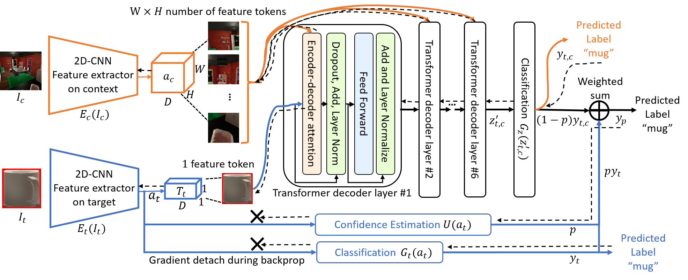

<div align="center">
  

  <h4>An object recognition model that leverages context information.</h4>

  <a href="#about">About</a> •
  <a href="#bigpicturenet-model">BigPictureNet Model</a> •
  <a href="#code-architecture">Code Architecture</a>
</div>


---

## About

Conventional object recognition models are designed for images that are focused on a single object. While it is of course always possible to crop a large image to an object of interest, a lot of potentially valuable contextual information is sacrificed in that process. As our experiments show, humans are able to make use of additional context to reason about the object of interest and achieve considerably higher recognition performance.

Our model – BigPictureNet – is designed to shrink this gap between human and computer vision capabilities by looking at the big picture and leveraging the contextual information.


## BigPictureNet Model
<div align="center">
  
</div>


## Code Architecture

- All relevant components are implemented in `core/`.
- We use COCO-style annotations for train and test sets. An example can be found in the `debug/` folder.
- Training and testing can be performed with `train.py` and `test.py` respectively. Annotations, image directory and relevant parameters should be set via command line arguments. Available command line arguments and can be displayed by running `python train.py --help` and `python test.py --help` respectively.


#### Example

```
python train.py --annotations debug/annotations.json --imagedir debug/images
```

